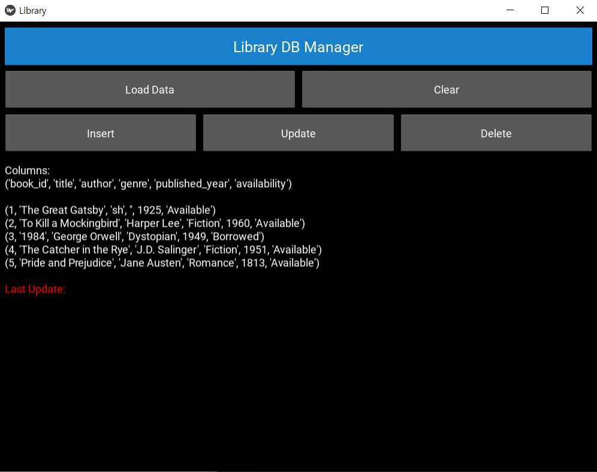
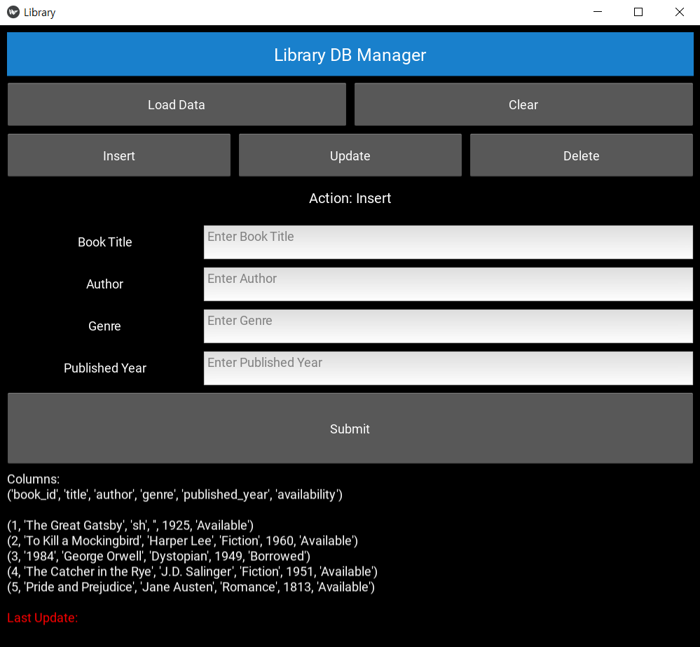
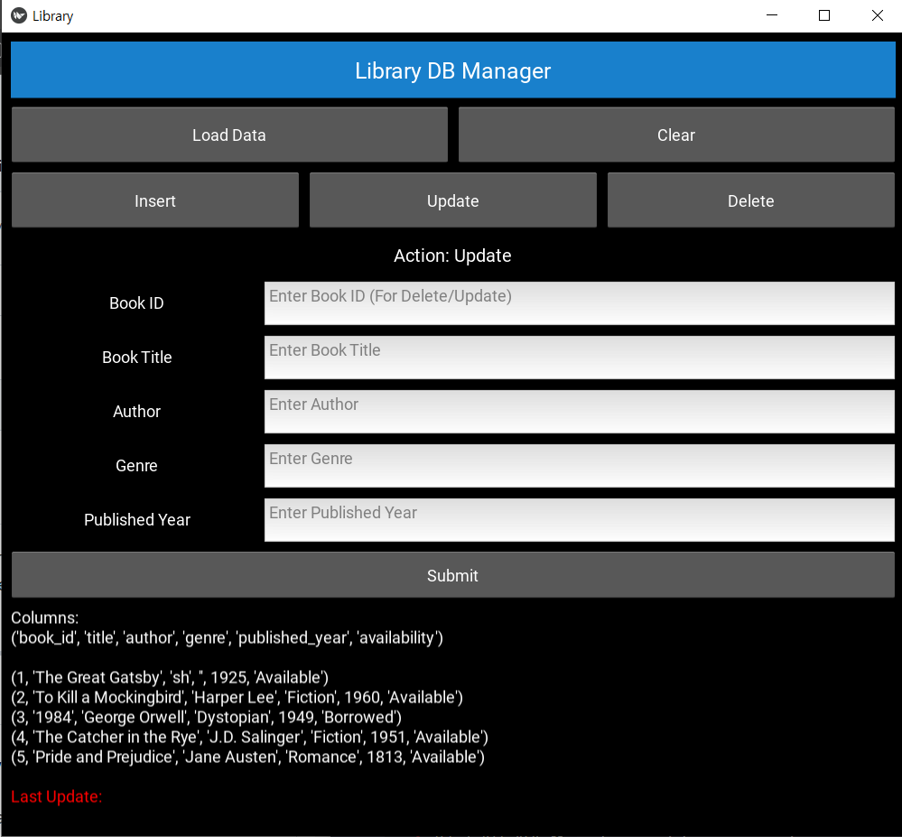
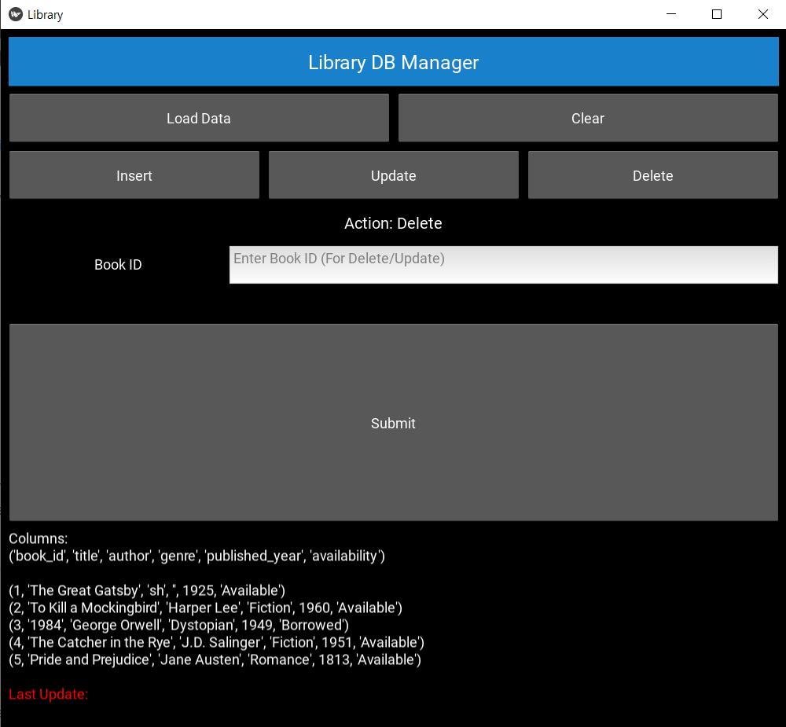

# Library DB Manager 📚

Library DB Manager is a Python application that provides a graphical interface for managing a library database. The app is built using [Kivy](https://kivy.org/) for the GUI and [MySQL](https://www.mysql.com/) as the database backend.

---

## Screenshots 📷

<table>
<tr>
    <td align="center">
        <h3>Home Screen</h3>
        
    </td>
    <td align="center">
        <h3>Insert Operation</h3>
        
    </td>
</tr>
<tr>
    <td align="center">
        <h3>Update Operation</h3>
        
    </td>
    <td align="center">
        <h3>Delete Operation</h3>
        
    </td>
</tr>
</table>

---

## Features ✨

- **CRUD Operations**: Perform Create, Read, Update, and Delete operations on the `books` table.
- **Dynamic GUI**: Interactive fields toggle based on the selected operation.
- **SQL Integration**: Uses MySQL to manage data securely and efficiently.
- **Animation**: Smooth transitions when input fields are toggled.

---

## Technologies Used 💻

- **Python**: Core programming language.
- **Kivy**: For building the graphical user interface.
- **MySQL**: Database to store and manage library data.
- **Kivy Animation**: For smooth transitions in the app.

---

## Prerequisites ⚙️

1. Python 3.7 or later installed on your machine.
2. MySQL installed and configured.
3. Required Python libraries:
   ```bash
   pip install kivy
   pip install mysql-connector-python
   

### Steps
1. Clone the repository:
```bash
git clone https://github.com/seohyeoning/library_db_manager.git
cd library_db_manager
```

2. Set up the database:
Create a library_db database in MySQL.
Run the following SQL to create the books table:
```sql
CREATE TABLE books (
    book_id INT AUTO_INCREMENT PRIMARY KEY,
    title VARCHAR(255) NOT NULL,
    author VARCHAR(255),
    genre VARCHAR(100),
    published_year INT
);
 ```

3. Run the app:
```bash
python main.py
```

## Steps 🛠️
1. Clone the repository:
```bash
git clone https://github.com/seohyeoning/library_db_manager.git
cd library_db_manage
```
2. Set up the database:
- Create a ```library_db``` database in MySQL.
- Run the following SQL to create the ```books``` table:
```bash
    CREATE TABLE books (
        book_id INT AUTO_INCREMENT PRIMARY KEY,
        title VARCHAR(255) NOT NULL,
        author VARCHAR(255),
        genre VARCHAR(100),
        published_year INT
    );
```
3. Run the app:
```bash
    python main.py
```

## Usage 🧩
### Operations
- Load Data: Fetch and display all records from the database.
- Insert: Add new book details to the database.
- Update: Update book details using the Book ID.
- Delete: Remove a book record using the Book ID.
### Example Workflow
- Click Insert to toggle input fields for adding a book.
- Enter the details and click Submit.
- Use Load Data to verify the new record.

## LICENSE 📝
This project is licensed under the MIT License. See [LICENSE](./LICENSE) for more details. 
</details>

